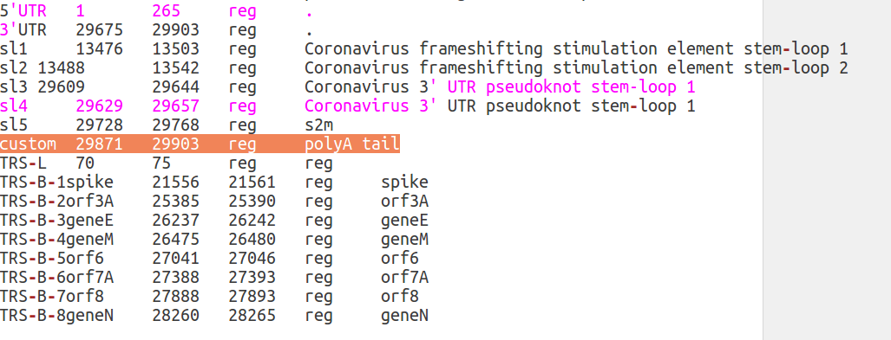

Functional annotation
=====================

The ``annotate.pl`` utility is used to perform functional annotation of SARS-CoV-2 variants. The program can be executed very easily, by running:

::

  perl annotate.pl --in inputFile

This script is very simple to use. Only 3 parameters are accepted in input: 

#. **--in** to specify the input file;

#. **--out** to set the name of the output file;

#. **--conf** to provide a configuration file;

.. warning::

   The configuration file, is nothing but a simple table that contains the name of the files that should be used to provide different types of functional annotations. A valid example of a configuration file is provided by *corgat.conf*  as included in the current repo.(See below). Each row of this file is associated with a keyword (first column), to which the name of the file that should be used follows (second column). In particular:
   
     * ``genetic -> specifies the name of the file with the genetic code``
     * ``genome  -> the name of the file with the reference genome sequence``
     * ``annot   -> a table, with the coordinates of functional genomic elements (see below)``
     * ``hyphy   -> the file used to provide annotation of variants under selection according to hyphy``
     * ``AF      -> the file with allele frequency data``
     * ``EPI     -> the files with annotations of predicted epitopes``

.. warning::

Since the number of publicly available genome sequences is constantly increased over times, some of these files are updated on a monthly basis. In particular the *hyphy* and *AF* files. The corgat.conf file as provided in this repo, is configured to use the most up to date version of these files, each denoted by the *current.csv* suffix. Older versions of each file are stored in the *hyphy_data* and *AF* folders respectively. Should you need to use an older version of these files for any specific reason, you can simply modify your copy of corgat.conf accordingly. Average users however, should not need to modify this file. 

The output consists in a simple table, delineated by <tab> (tabulations) and formatted as follows. If/when the docker or Galaxy version of this software are used, the output can be visualized directly in your browser:

================ ========== ========== ============================================================== ================ ======================== ================================ ======================
Genomic position Ref allele Alt allele Funct Elem annot                                               Allele Frequency Epitopes annot           Selection annot                  MFE annot 
================ ========== ========== ============================================================== ================ ======================== ================================ ======================
376              G          T          nsp1:c.111G>T,p.E37D,missense;orf1ab:c.111G>T,p.E37D,missense; 0.166            FGDSVEEVL,1,HLA-C\*08:01 fel:true;meme:true;kind:positive NAi
29742            G          T          3'UTR:nc.G68T,NA,NA,NA;sl5:nc.G15T,NA,NA,N;                    0.735            NA                       NA                               mfe:-5.6;-4.76;-10.93;
================ ========== ========== ============================================================== ================ ======================== ================================ ======================

Annotation of functional genomic elements, consists of 4 fields, separated by commas (**,**):

#. name of the element, followed by ":"

#. relative position (c.= coding, nc.=non coding)

#. amino acid change (NA if a non coding element)

#. predicted effect on protein (NA if a non coding element)

When a variant is overlapped by more than one element, multiple annotations are reported, separated by semicolumns (**;**)

Annotation of epitopes is according to https://doi.org/10.1038/s10038-020-0771-5 . The sequence of the epitope/epitopes is reported followed by the number and by the names of the HLAs that are predicted to recognize the epitope. Multiple annotations are separated by semicolumns (**;**). 

For example in *FGDSVEEVL,1,HLA-C\*08:01*, **FGDSVEEVL** is the sequence of the predicted epitope/epitopes, **1** and **HLA-C\*08:01** indicate that the sequence is recognized by just 1 HLA, that is **HLA-C\*08:01**.

Annotation of sites under selection is very simple: **fel:** is used to indicate if the site is under selection according to fel. Possible values are *true* or *false*. **meme** is the equivalent, but for the meme method. The **kind:** field indicates the type of selection: *positive* or *negative*.

The MFE annot column reports **predicted changes** in MFE (minimum free energy) for variants associated with secondary structure elements. Please notice that this annotation does not report the predicted MFE, but the **difference** between the MFE of the element based on the reference genome sequence, with the MFE calculated on the alternative sequence. Negative values indicate a descrease in MFE (a more stable structure). Positive values are suggestive of a less stable structure (increase in MFE). Three values are reported, representing respectively MFE of: *optimal secondary structure*, *the thermodynamic ensemble* and *the centroid secondary structure*. Obviusly there is no absolute cut-off for interpreting these results, however high shifts (>1 or <-1) in MFE might be suggestive of functional implications.

Functional annotation: Important!
---------------------------------

Please notice, that to work properly ``annotate.pl`` needs to have access (read) several annotation files which provide the different types of functional annotations. If these files are not available, the program will exit with an error, complaining that one or more of the files are missing.

These files that are **strictly required** and can be downloaded from the current github repository. The repository itself is updated on a monthly. So it is **highly advised** that the latest version of the files should be downloaded **before** you perform functional annotation. The most recent version of each file 
 is downloaded automatically in the Galaxy and docker instances.
 
.. warning::

   All the files need to be (and normally are) in the **same folder** from which ``annotate.pl`` is executed.

The annotation files, all in simple text format include:
#. *genetic_code* -> 3 column file with the standard genetic code

#. *GCA_009858895.3_ASM985889v3_genomic.fna* -> the reference SARS-CoV-2 genome assembly sequence

#. *annot_table.pl* -> a 4 column tabular file with genomic coordinates of functional genomic elements

#. *AF_current.csv* -> tabular file with allele frequency data

#. *MFE_annot.csv* -> tabular file with Mininum Free Energy predictions for all the possible Single Nucleotide substitutions in secondary structure elements

#. *epitopes_annot.csv* -> tabular file with annotation of predicted epitopes

#. *hyphy_current.csv* -> tabular file with aa residues under selection according to meme/fel

Please see below for a brief guide that will help you to define additional functional elements in ``annot_table.pl``.

Functional annotation: adding functional elements!
--------------------------------------------------

Functional genomic elements in the genome of SARS-CoV-2 are specified by a four columns tabular format file called ``annot_table.pl``. This file can be used to specify additional functional elements and/or use a personalized annotation. The file has a very simple format: for every element, the first three columns specify respectively, the name of the element (column 1), the start (column 2) and the end coordinate (column 3) on the genome. The fourth column defines the functional class of the element. At the moment 4 different classes are supported: 
#. protein coding sequences (*cds*)

#. regulatory elements (*reg*)

#. cleavage sites of SARS-CoV-2 polyproteins (*clv*)

#. Sites associated with epigenetic modifications (*epi*)

Finally the fifth column is optional and contains an additional comments and annotations.

To add elements to ``annot_table.pl`` you need to open this file with your favourite text editor. First of all position yourself in the CorGAT directory (the directory that was created when you downloaded CorGAT from Github). You should see a file named ``annot_table.pl`` . Open this file with your favourite text editor. You should see something similat to this:

   
At this point any modification of the annotation file should be very simple. For example you can delete any element functional element by deleting the corresponding entry in this file. To add a novel element instead, you should add a line. As you can see from this example, where a custom annotation (custom) of the polyA tail of the genome as been added. 

   
Please rememember that the different columns of this files are delineated by ``tabulations`. Currently the Galaxy version of CorGAT does not allow the specification of a custom ``annot_table.pl`` file. In the docker version you can find/edit this file in the /export/covid_wrapper/funct_annot directory.
You can use the same procedure as illustated above to edit the file.

