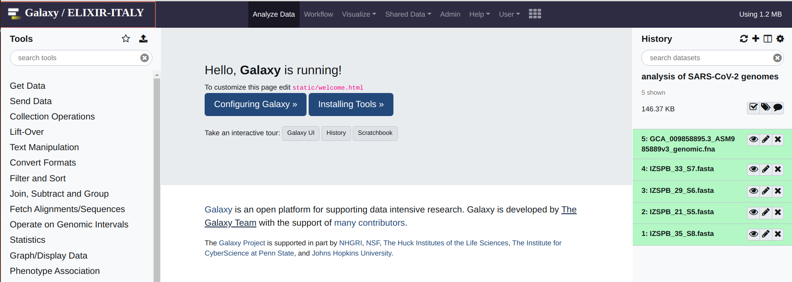
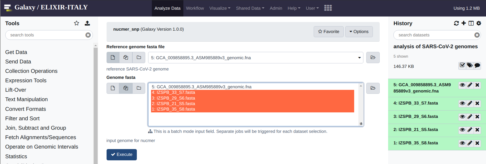
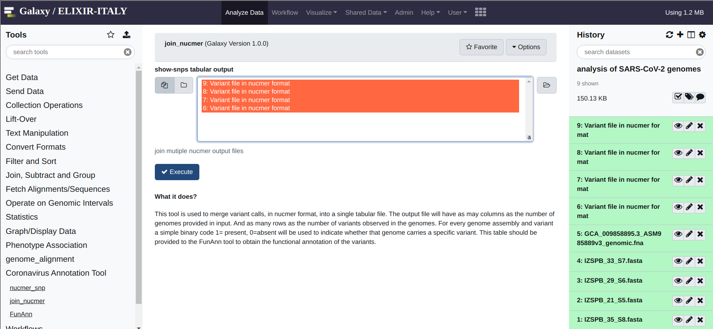
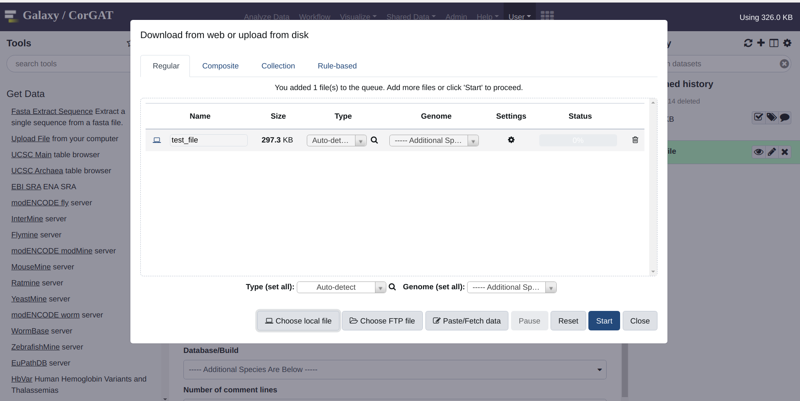
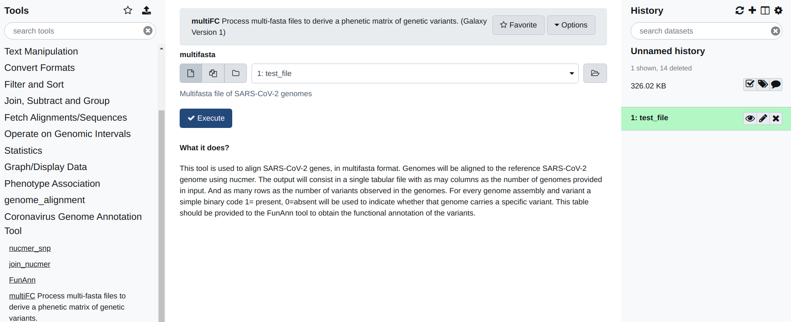
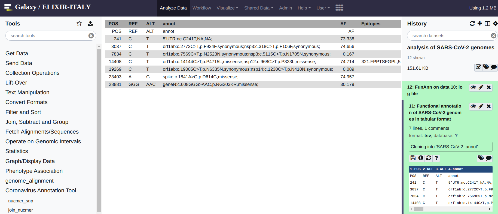

Analysing your data
===================

Multiple Fasta files
===================

.. warning::

   Please notice, this manual provide just a quick and simple reference for the usage of the Galaxy version of CorGAT. Please refer to https://galaxyproject.org/learn/ for a complete and accurate reference on how to use Galaxy.

Once all the files have been imported, the analysis with CorGAT is very straightforward.

If everything was done according to the instruction provided in the first part of this manual, you should see something like this:

The first operation that you are required to do, is the alignment between your genome assemblies and the reference genome. This can be done by means of the “nucmer_snp” which is found under the “Coronavirus Genome Annotation Tool” menu. Simply click on the tool.

The interface is very simple: you are only required to indicate the reference (form on the top) and the “target” genome (form on the bottom). Multiple target genomes can be provided by clicking on the “multiple datasets icon”. Once all the “target genomes” have been selected, to run the analysis you can simply hit “Execute” (the blue button).

See below for an example:

After a brief while, you should obtain an output file for every input genome. These file need to be merged before performing the functional annotation of the variants. This operation is performed by applying the ``join_nucmer`` utility, again under ``Coronavirus Genome Annotation Tool``. The interface of the tool is again very simple. All you need to do is to select the files that need to be merged from the form. And once ready, again hit execute.

The output will be a single file called ``consolidate_variants``.  This last file, will provide the input of the functional annotation tool, ``FunAnn`` which is found under the ``Coronavirus Genome Annotation Tool`` menu. The output consists in a tabular format file, where polymorphic positions are reported in the rows. And genomes, as indicated by their header in the respective fasta files, are reported in the columns.  A value of 1 is used to indicate variants that are observed/present. Conversely a value of 0 zero indicate variants that are absent. Basically each column, represents the "haplotype" of the genome sequence of that particular genome.

Using a single Multifasta file
======================

Use the get data menue to upload a multifasta file. In this case, the file is simply called "test"

   
Select the *multiFC* utility under the "Coronavirus Genome Annotation Tool" menue. You should see something very similar to the figure you see below. This tools is very easy to use. You just need to provide a multifasta file as input. By default the tool will align all the sequences included in this file, with the reference assembly of the genome of SARS-CoV-2, and derive a phenetic matrix of presence/absence of polymorphic positions with the same file format as that produced by the ``join_nucmer`` utility. This file can be used to provide the input for ``FunAnn`` .

 

Annotation
======================
FunAnn takes only a single file as its input. This is the file created by ``join_nucmer`` or by ``multiFC``. Please notice (above) that these files have the same format. To execute the functional annotation of the variants in your genome,  click on the ``FunAnn`` tool and provide the correct input file. Then hit execute. You should obtain 2 output files. A log file (hopefully empty) which reports possible errors encountered in the execution of the software, and a tabular file with the annotations. If no errors files were encountered, you should see an output file that reads like this:

Congrats! If you have reached this point you should now be able to use CorGAT to annotate genomic variants in your SARS-CoV-2 genomes.

Please refer to the paper or this documentation for a more complete description of the functional annotations provided by CorGAT.
