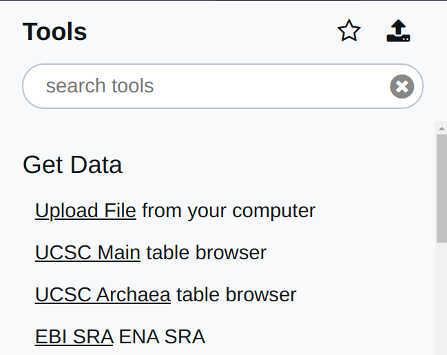
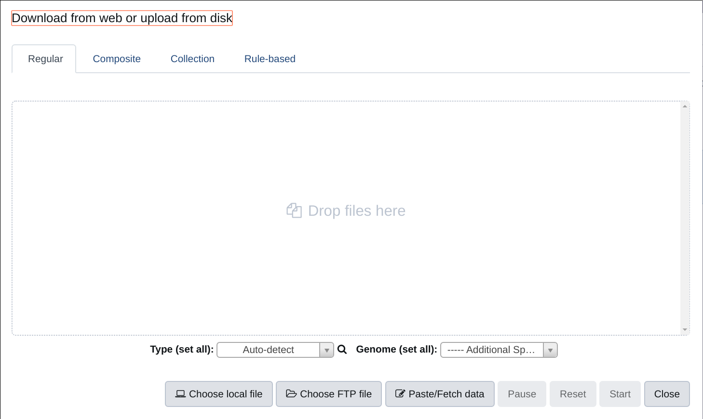
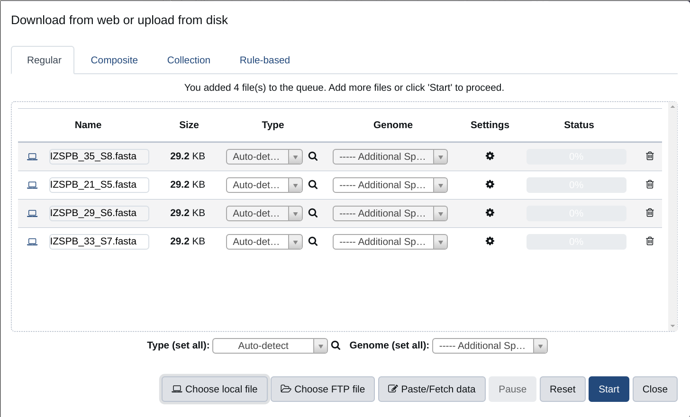
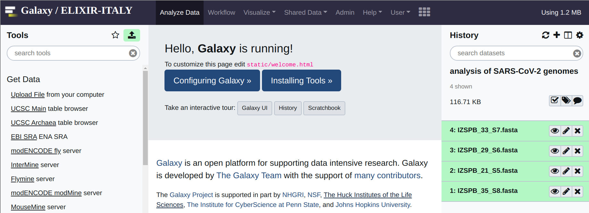
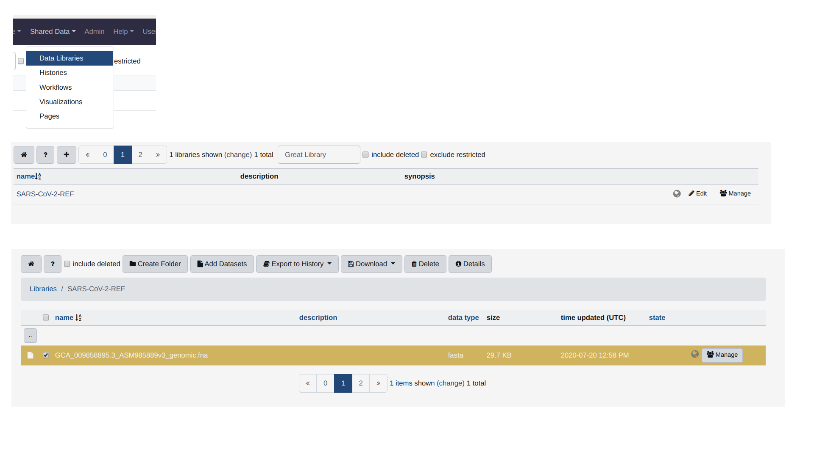

Importing your data
===================

.. warning::

   Please notice, this manual provide just a quick and simple reference for the usage of the Galaxy version of CorGAT. Please refer to https://galaxyproject.org/learn/ for a complete and accurate reference on how to use Galaxy

Before doing anything you are required to import your data into Galaxy. This operation  is very simple and can be performed by using the ``Upload file`` menu, under ``Get data``. As outlined in this figure:

You will be prompted with the following menu:

Select ``Choose local file`` and the folder on your system where you have your SARS-CoV-2 genome assemblies. These need to be in FASTA format. One genome per file. Please notice that the name specified in the header of your fasta will be used to identify each genome in all the subsequent steps of this analysis. Use sensible names, preferably avoid names containing strange characters or spaces. Select all the files that you want to upload to Galaxy. Multiple files can be selected at this time. Once you have selected all your files, you should obtain something that looks like the picture below. At that point hit start (the blue button). All the files will be imported in Galaxy.

Once your files are imported you should see something like the picture below, meaning that Galaxy is ready to analyse your data.

At this point before doing anything, you also need a copy of the reference genome.

This can be obtained from the following `link at NCBI <https://ftp.ncbi.nlm.nih.gov/genomes/all/GCF/009/858/895/GCF_009858895.2_ASM985889v3/GCF_009858895.2_ASM985889v3_genomic.fna.gz>`_.

Alternatively, you can use the copy of the genome that is preloaded in CorGAT. For that you need to

#. navigate to Shared Data and then Data Libraries, 

#. click on the library called SARS-CoV-2-REF

#. tick the file named GCA_009858895.3_ASM985889v3_genomic.fna (the only file in the library)

#. and then “export to history”. The file must be exported as a dataset.

Please refer to the picture below for all of these operations.

