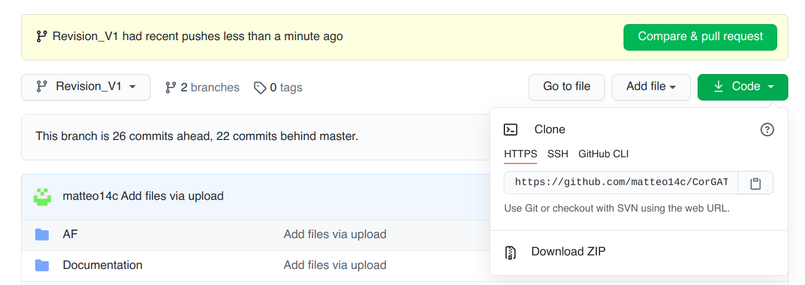

Prerequisites and usage
=======================

This software package is composed of 2 very simple scripts and a collection of files with functional annotation data. The only requirement is that you have an up to date installation (see below) of the Mummer package in your system and a copy of the reference genomic sequence, in fasta format. All the files (scripts, genomic sequences and accessory files) should be placed in the same folder. To install the command line version od CorGAT you can simply download the most recent version of the program, from the following [link]https://github.com/matteo14c/CorGAT/ .
Click on code, and then on Download Zip, as illustrated in this Figure:

At this point, you can place yoursef il the folder where the program was downloaded. For example if the default of your browser is the Downloads folder:

::

  cd Downloads

you should see a zip archive named ``CorGAT-Revision_V1.zip``. At this point to execute CorGAT you only need to unzip the archive and place yoursef in the CorGAT-Revision_V1 folded

::

  unzip CorGAT-Revision_V1.zip

::

  cd CorGAT-Revision_V1

Mummer installation
-------------------

Please follow this link https://sourceforge.net/projects/mummer/files/ for detailed instruction on how to install and run Mummer. Please notice that after you have succesfully compiled all the executables by running:

::

  make install

you will still need to place add these files to your executable PATH, either by adding/copying all the files to one of the directories already included in the PATH or by adding the whole mummer directory (where all the software was compiled) to the your PATH of executables. If for example all your executables are in a folder called "Mummer" in your home directory on a unix system you can symply run:

::

  export PATH=~/Mummer:$PATH
  
Mummer installation MacOS X
----------------------------

Download Mummer at: https://sourceforge.net/projects/mummer/files/latest/download and extract the archive (tar.gz) file.
Open up Terminal and:

::

  tar xvzf MUMmer3.23.tar.gz

As explained in the INSTALL file, included in the Mummer package to build Mummer:

::

  cd MUMmer3.23
  make check

If make check does not report any error everything should be ok, then run:

::

  make install

You should get something similar to `this <https://gist.githubusercontent.com/mtangaro/53ec0c88a21255aaf38f460b5cddb340/raw/eb2504d17d2606384fab4e4d805fafe66406087b/mummer_make_install.txt>`_.

::

Now that mummer you have successfully built the binaries are, you need to add them to $PATH. Run the following command with your favourite text editor:
::

  sudo vim /etc/paths

Enter your password, when prompted.
Go to the bottom of the file, and enter the path you wish to add. For example, if you built Mummer in /Users/yourname/test/MuMmer3.23, add this to the file:
::

  /usr/local/bin
  /usr/bin
  /bin
  /usr/sbin
  /sbin
  /Users/yourname/test/MUMmer3.23

Save the file in vim
::

  :wq
  
And finally you can test if everything is in place. Open a *NEW* terminal. To test if mummer is now in your PATH, run:
::

  echo $PATH
  
You should see something like:
::

  echo $PATH
  /usr/local/opt/ruby/bin:/usr/local/bin:/usr/bin:/bin:/usr/sbin:/sbin:/Users/yourname/test/MUMmer3.23

The Mummer package, and all its utilities are now available to be executed in your shell, and for CorGAT as well. For example, type “nucmer” to execute nucmer:
::

  nucmer
  USAGE: nucmer  [options]  <Reference>  <Query>
  
  Try '/Users/marco/IBIOM-CNR/CorGAT/MUMmer3.23/nucmer -h' for more information.

Download of the Reference genome 
--------------------------------

The reference genome of SARS-CoV-2 can be found `here <https://ftp.ncbi.nlm.nih.gov/genomes/all/GCF/009/858/895/GCF_009858895.2_ASM985889v3/GCF_009858895.2_ASM985889v3_genomic.fna.gz>`_.

On a unix system you can download this file using wget

::

  wget https://ftp.ncbi.nlm.nih.gov/genomes/all/GCF/009/858/895/GCF_009858895.2_ASM985889v3/GCF_009858895.2_ASM985889v3_genomic.fna.gz

followed by

::

  gunzip GCF_009858895.2_ASM985889v3_genomic.fna.gz

Please notice that however the *align.pl* utility is going to download the file for you, if a copy of the reference genome is not found in the current folder. However, since the ``wget`` command is required this is supposed to work only unix and unix alike systems. *align.pl* will complain with an error if ``wget`` is not available in your system.
